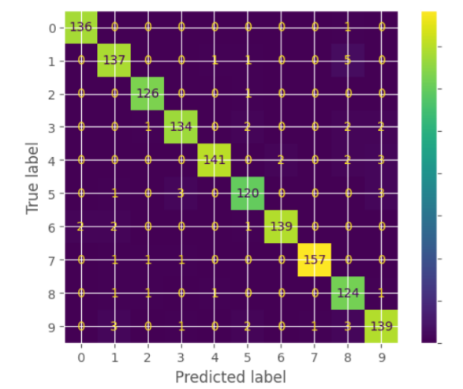
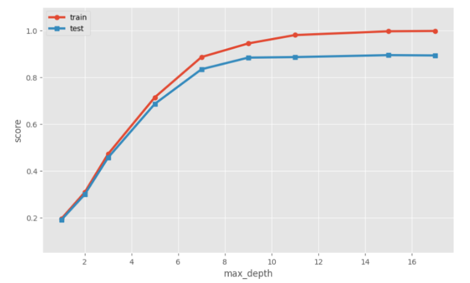
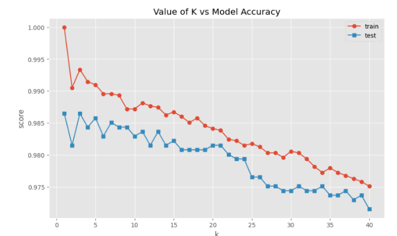
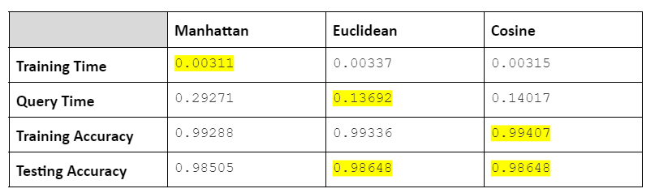
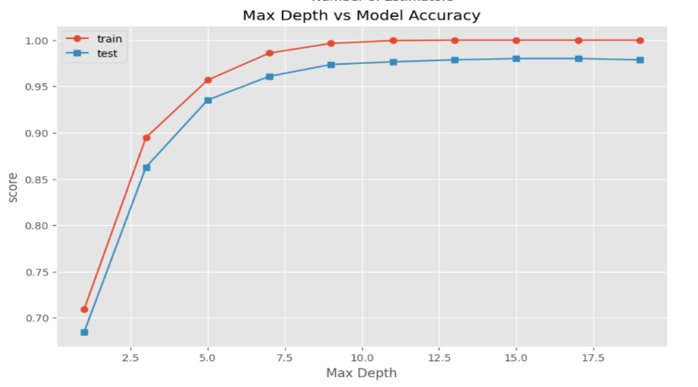
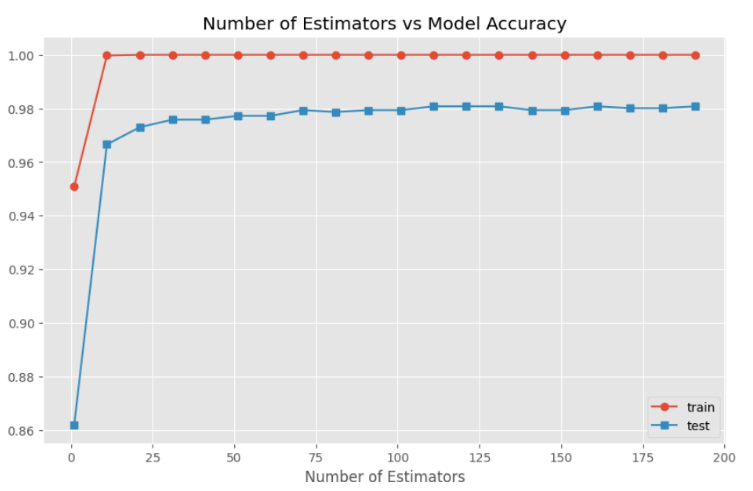
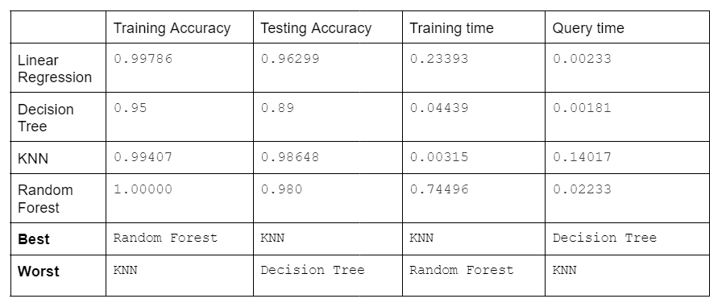
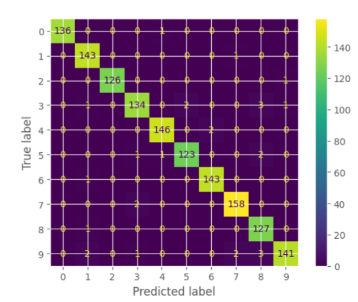

# Machine Learning Final Project

https://archive.ics.uci.edu/dataset/80/optical+recognition+of+handwritten+digits

## PART ONE: DATA EXPLORATION

For this project, I am using the Optical Recognition of Handwritten Digits dataset, a dataset with 64 attributes to determine which number 0-9 is written. It is a classification problem with the target value being the ‘class’ column: the number 0-9. The dataset has 65 numerical features, consisting of 64 independent features and 1 target value, and 5,620 samples. A machine learning model learns the different features and attributes and how strongly they correlate to a specific target, in this case, numbers 0-9. After training a model on this dataset, it will be able to learn about the features of a number and predict which digit is written. 

## PART TWO: MACHINE LEARNING

For this project, I will create four machine learning models [a regression model, a decision tree model, a k-nearest-neighbor (KNN) model, and a random forest model], each one of which I will test the accuracy to see which model performs best with this particular dataset. For all of the models, I will split the dataset’s samples into training and testing. The model will train on the training set and then treat the testing set like new data on which we can see how well the model performs. 

**REGRESSION**

For this model, I will use Logistic Regression to classify which digit is written based on the number’s features. After training the data, I tested the model with some new data. The training accuracy is 0.9978 , while the testing accuracy is 0.9629. These numbers along with the time taken to train and query the data [a training time of 0.1891; a query time of 0.0022 ] seem to prove that this is a good model. For a visual, I attached a Confusion matrix. 

This matrix proves that this is a good model. Most of the predictions of numbers matched up with their target values. Especially considering the many samples that were taken, very few of them were mistaken.

**DECISION TREE**

The next model I made is a decision tree model. When I created this model with its default parameters, I got the following accuracy scores: a training score of 1.00 and a testing score of 0.90.  However, to test if this is the best version of my model, I experimented with different max_depths. Max_depth is the parameter that tells the program how deep to make the tree. Having a max_depth that is too large can often end in an overfit model which will cater to the training data but not very well to the testing data or any other new data. Therefore, we want to find a max_depth that delivers the highest testing score, with not too much variance. Using this model complexity curve, we can choose the optimal value for max_depth.

The testing scores seem consistent for any max_depth over 9. Therefore, I would choose 9 as max_depth because at that point there is a low bias, while maintaining a low variance. Using 9 as my max_depth, I tested this new model, which resulted in a slightly higher bias, but a significantly lower variance; the training accuracy was 0.95 and the testing accuracy was 0.89.  Even though the testing score is 0.1 points less than the default model, I chose to settle with a max_depth of 9 because the variance is drastically lower. Therefore the best performance of this model occurs when max_depth is 9 nodes, with an accuracy of 0.95 and 0.89 and a time of 0.04439 and 0.00181 for the training and testing data, respectively. 

**K-NEAREST NEIGHBORS (KNN)**

The next model I created is a K-Nearest-Neighbors, also known as KNN, model. This model classifies the data based on ‘location’. The data is ‘located’ according to different features and attributes. Once trained, the data points are classified by their target value, in this case, their number, making it that generally the data points in the same proximity will have the same classification. K represents the number of closest neighboring data points that will be used to determine what the unknown point’s target value will be. The target value is determined by the majority classification of data points in the select group of k-neighbors. Therefore, the number of K neighbors that are considered strongly affects the outcome of the unknown data point. When k=1, the unknown data point will inevitably take the classification of its closest neighbor and doesn’t take anything else into account. Yet, when k becomes too large, it considers too many neighbors, and therefore, loses precision. The model complexity curve below can be used to determine what the optimal value for k is. 

The testing score has the lowest bias at both one and three. I chose k=3 as the optimal value for k, because not only is k=1 generally overfit to the training data, k=3 also has a lower variance. Now that I have the optimal value for k, I chose which metric to use. Different metrics measure distance differently, and for a model that is completely based on measures of distance to determine the closest neighbors, the metric used can make a big difference on the outcome. There is no metric that works better for all problems; therefore, I tested the time and accuracy on the following three metrics to determine which one is most suitable for this model: Manhattan, Euclidean, and Cosine. The table below shows both the accuracy and timing for the testing and training data for each of these metrics. 
All values are rounded to the fifth decimal point. The highlighted sections signify the best options in terms of time or accuracy for the training and testing datasets.

From this table, it is clear that all of these metrics are good options, with their differences being minute. However, if I had to choose one, I’d choose the Cosine Metric. While its testing accuracy is the same exact as the Euclidean metric, its training time and training accuracy are more ideal, leaving its query time only decimals higher than the Euclidean metric.

**RANDOM FOREST**

The next model I made is a Random Forest model. Random Forest is an example of an ensemble machine learning model. Ensemble learning uses a bunch of different models and eventually incorporates them into one model, with the goal of reducing variance and overfitting. Random Forest is an ensemble method specifically for decision trees; it splits into a bunch of decision trees and incorporates them into one model- a random forest. This works using “bagging”. Bagging is a method that uses bootstrap sampling to ensure that the forest is random. Bootstrap Sampling uses a chosen number of samples, and for each tree, it randomly selects that number of samples from the training data, making it possible that each decision tree would be different, even though they are based on the same overall training data. The next part of bagging is training those decision trees. Once the decision trees are trained, they get introduced to new information. Each tree classifies that new piece of data and the majority classification becomes the target value of the unknown data. 

This first step I took in creating this model was choosing the best value for max_depth. Like with a typical decision tree, the max_depth parameter determines how deep the tree would be. If a tree is too deep, it will likely be overfit to the training data, causing a high variance. From the model complexity curve below, I chose the max_depth value of 15, which has both the lowest bias and variance.

Next I made a model complexity curve to determine how many n-estimators there should be, how many trees the forest should have. 

From the graph, the number that I thought was best was 125, with a low bias and variance. Generally, the more trees, the greater the power is in numbers. However, the more trees there are, the longer the model takes to run. Now that I have chosen my ideal parameters, I made a random forest with a max_depth of 15 and 125 estimators, with a training accuracy of 1.00 and a testing accuracy of 0.98. The training time was 0.74496 and the query time was 0.02233, making it a slower, but accurate model. 

## PART THREE: COMPARING AND CONTRASTING PERFORMANCE

After completing these different models, I made a table comparing and contrasting the different times and accuracies of each model to be able to determine which model is the most accurate and efficient. 

**TRAINING ACCURACY**

The best model in terms of training accuracy is the Random Forest. All of the models are very close in terms of training accuracy, because most models are able to train well because they are learning the features along with the given target data. The big challenge is not to become overfit to the training data. Generally, if the training accuracy is 1.00, one would be nervous that the model is overfit, but because a random forest is an ensemble model, whose essence is to avoid overfit models, I don’t think that concern stands in this case. 

The worst model in terms of training accuracy is the KNN model. However it is only off by a few hundredths of a decimal point, so I don’t think it's a significant deterrent or difference.

**TESTING ACCURACY**

The best model in terms of testing accuracy is KNN. That could be because this classification problem works well with location. It seems like the features are very specific for their numbers and don’t overlap too much in-terms of location. 

The worst model in terms of testing accuracy is a Decision Tree. This could mean that the splits of the decision tree are not able to be pure separations, perhaps implying that the features overlap for multiple target values, in this case, numbers.

**TRAINING TIME**

The best model in terms of training time is KNN. That could be because when training the data, it simply just is placed in its ‘location’ based on its classification. It doesn’t need to train based on other features or make any metric measurements. 

The worst model in terms of training time is Random Forest. That’s no surprise because the random forest has to train all of the decision trees in the forest. And before doing that, it needs to randomly select portions of the training data. Therefore, it takes a long time, but is an accurate model

**QUERY TIME**

The best model in terms of query time is a decision tree. With a decision tree, it doesn’t need to create a tree, it simply uses the already made decision tree to discover its classification. 

The worst model in terms of query time is KNN. Because KNN needs to calculate so many metrics while querying, it takes a long time. It needs to calculate metrics for all potential near neighbors in order to select the K-nearest-neighbors. After that, it calculates the majority of all of the nearest neighbors.

**KNN- FURTHER EVALUATION**

The KNN model delivered the best testing accuracy. Below is a Confusion matrix for this classification machine learning model. This matrix shows that the KNN is a very accurate model. The numbers in colored squares across the diagonal represent how many correctly classified samples there were of that target value. All of the other numbers represent the number of misclassified samples for each target value and what the false prediction was. The highest number of misclassified values for each independent target value is three, meaning each number was incorrectly classified at most three times. That is a significantly low number, especially considering that there were thousands of samples tested. 

